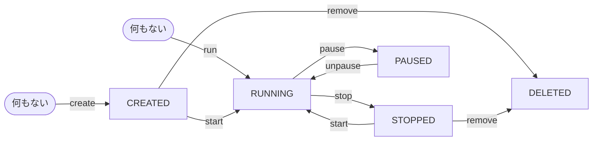

# dockerの練習


## はじめに

### 起動

```sh
docker-compose up -d
docker-compose exec dind bash
```

これだけやったら、あとはどこから始めても問題ない。

### 終了

```sh
docker-compose down
```

## `docker ps`と hello-worldコンテナ

```sh
dind/src$ docker ps
CONTAINER ID   IMAGE     COMMAND   CREATED   STATUS    PORTS     NAMES
```
もちろん何もない

```sh
docker run hello-world
```

いろんなdocker imageを保持している[dockerhub](https://hub.docker.com/)から[hello-world](https://hub.docker.com/_/hello-world)イメージがダウンロードされて`Hello from Docker!`を含むメッセージが出てくる。

ここで`docker ps` すると

```sh
dind/src$ docker ps
CONTAINER ID   IMAGE     COMMAND   CREATED   STATUS    PORTS     NAMES
```

一見何もないように見えるが実は残ってる

```sh
dind/src$ docker ps -a
CONTAINER ID   IMAGE         COMMAND    CREATED         STATUS                     PORTS     NAMES
993729cdbab1   hello-world   "/hello"   4 seconds ago   Exited (0) 3 seconds ago             crazy_visvesvaraya
```

これを消すためには `docker rm コンテナID`

```sh
dind/src$ docker rm 993729cdbab1
993729cdbab1
dind/src$ docker ps -a
CONTAINER ID   IMAGE     COMMAND   CREATED   STATUS    PORTS     NAMES
```

いちいち`docker ps -a`した後、`docker rm コンテナID` はめんどくさい。

なので runするときには原則 `docker run --rm` とする

```sh
dind/src$ docker run --rm hello-world

Hello from Docker!
This message shows that your installation appears to be working correctly.

(中略)

dind/src$ docker ps -a
CONTAINER ID   IMAGE     COMMAND   CREATED   STATUS    PORTS     NAMES
```

ダウンロードしてきたイメージはどこにあるのか？

```sh
dind:/src$ docker images
REPOSITORY    TAG       IMAGE ID       CREATED        SIZE
hello-world   latest    9c7a54a9a43c   4 months ago   13.3kB
```

このまま取っておくこともできるが、もう使わないなら

```sh
dind:/src$ docker rmi hello-world
Untagged: hello-world:latest
Untagged: hello-world@sha256:4f53e2564790c8e7856ec08e384732aa38dc43c52f02952483e3f003afbf23db
Deleted: sha256:9c7a54a9a43cca047013b82af109fe963fde787f63f9e016fdc3384500c2823d
Deleted: sha256:01bb4fce3eb1b56b05adf99504dafd31907a5aadac736e36b27595c8b92f07f1
dind:/src$ docker images
REPOSITORY   TAG       IMAGE ID   CREATED   SIZE
```

もちろん、`hello-world` の代わりに IMAGE IDの `9c7a54a9a43c`でもよい

## バッググラウンドでコンテナ起動

nodeの入ったイメージでnodeのバージョンを出してみる

```sh
dind:/src$ docker run --rm node:slim node --version
Unable to find image 'node:slim' locally
slim: Pulling from library/node
a803e7c4b030: Pull complete
1422c0cc5b32: Pull complete
6fa8bbe44fd1: Pull complete
5d16d23ed396: Pull complete
c9d941e20b9f: Pull complete
Digest: sha256:24a8b77508a4edaa99ef31f020e915da31c87068b4164d6746bf0c1684c71f98
Status: Downloaded newer image for node:slim
v20.7.0
```

nodeでhello world

```sh
dind:/src$ docker run --rm node:slim node -e 'console.log("helloworld");'
helloworld
```

先程、dockerイメージをダウンロードしたので今回はすぐに動いた。
node:slim と slimタグがついてるのはslimバージョンじゃないとこのイメージでかいから。
イメージを確認すると

```sh
dind:/src$ docker images
REPOSITORY   TAG       IMAGE ID       CREATED      SIZE
node         slim      2e95c92a0f1e   4 days ago   247MB
```

では、このnodeをバックグラウンドで動かしてみよう

```sh
dind:/src$ docker run --rm -dt node:slim
1faafc8c3ec00793e159369ce614b897a8486404ab7ea1e6ab2664d567adbbc0
dind:/src$ docker ps
CONTAINER ID   IMAGE       COMMAND                  CREATED         STATUS         PORTS     NAMES
1faafc8c3ec0   node:slim   "docker-entrypoint.s…"   3 seconds ago   Up 2 seconds             stupefied_matsumoto
```
コンテナIDで止めたりするのが面倒なので、一旦止めて名前をつけて起動し直す

```sh
dind:/src$ docker kill 1faafc8c3ec0
1faafc8c3ec0
dind:/src$ docker ps
CONTAINER ID   IMAGE     COMMAND   CREATED   STATUS    PORTS     NAMES
dind:/src$ docker run --rm -dt --name my_node node:slim
98c703287c92fd727670edf3590bca36815f50266b20494df3dd523f13250362
dind:/src$ docker ps
CONTAINER ID   IMAGE       COMMAND                  CREATED         STATUS         PORTS     NAMES
98c703287c92   node:slim   "docker-entrypoint.s…"   5 seconds ago   Up 4 seconds             my_node
```

my_nodeという形でnodeが立ち上がっている
`-d` と`-t` オプションつまり`-dt` はそれぞれ、バックグラウンドで動かすのと、ttyといって入力を受け付ける形ですぐにnodeが終了しないようにしている

このバックグラウンドで動作しているmy_nodeでhello_worldを出力させてみる

```sh
dind:/src$ docker exec my_node node -e 'console.log("hello-world");'
hello-world
```

`docker exec コンテナ名`コマンドはバックグラウンドで動作しているコンテナに接続してコマンドを実行することができる

`docker exec` は動作しているコンテナに接続しているので、ファイルを書き換えるとコンテナが動作している間保存される。

```sh
dind:/src$ docker exec my_node sh -c 'echo hello world > /tmp/hello.txt'
dind:/src$ docker exec my_node sh -c 'cat /tmp/hello.txt'
hello world
```

終わったので削除する

```sh
dind:/src$ docker kill my_node
my_node
dind:/src$ docker ps
CONTAINER ID   IMAGE     COMMAND   CREATED   STATUS    PORTS     NAMES
```

## ２つのコンテナ同時起動

`docker run` のときだけでなく、予めコンテナイメージを`docker pull`でダウンロードすることもできる。
[node](https://hub.docker.com/_/node)と[python](https://hub.docker.com/_/python)のコンテナイメージをダウンロード

```sh
dind:/src$ docker pull node:slim
slim: Pulling from library/node
a803e7c4b030: Pull complete
1422c0cc5b32: Pull complete
6fa8bbe44fd1: Pull complete
5d16d23ed396: Pull complete
c9d941e20b9f: Pull complete
Digest: sha256:24a8b77508a4edaa99ef31f020e915da31c87068b4164d6746bf0c1684c71f98
Status: Downloaded newer image for node:slim
docker.io/library/node:slim
dind:/src$ docker pull python:slim
slim: Pulling from library/python
a803e7c4b030: Already exists
bf3336e84c8e: Pull complete
eb76b60fbb0c: Pull complete
a2cee97f4fbd: Pull complete
0358d4e17ae3: Pull complete
Digest: sha256:edaf703dce209d774af3ff768fc92b1e3b60261e7602126276f9ceb0e3a96874
Status: Downloaded newer image for python:slim
docker.io/library/python:slim
```

この２つのコンテナイメージをバックグラウンドで同時起動してみる

```sh
dind:/src$ docker run --rm -td --name my_node node:slim
398c15ac22b4091f16563c36e23e458b10840cb9cbc181f647acdb9518e70644
dind:/src$ docker run --rm -td --name my_python python:slim
fdf8c0381986bf0401a84150d2ae1c537a5bd5ea34861020c5099a3ede77bd21
dind:/src$ docker ps
CONTAINER ID   IMAGE         COMMAND                  CREATED          STATUS          PORTS     NAMES
fdf8c0381986   python:slim   "python3"                3 seconds ago    Up 2 seconds              my_python
398c15ac22b4   node:slim     "docker-entrypoint.s…"   19 seconds ago   Up 19 seconds             my_node
```

このように、複数のコンテナを同時に実行できる。
これがコンテナの醍醐味でもある。

```sh
dind:/src$ docker exec my_node node -e 'console.log("helloworld")'
helloworld
dind:/src$ docker exec my_python python -c 'print("helloworld")'
helloworld
```

もちろん my_nodeコンテナではpythonは動かないし、逆もそう。

```sh
dind:/src$ docker exec my_python node -e 'console.log("helloworld")'
OCI runtime exec failed: exec failed: unable to start container process: exec: "node": executable file not found in $PATH: unknown
dind:/src$ docker exec my_node python -c 'print("helloworld")'
OCI runtime exec failed: exec failed: unable to start container process: exec: "python": executable file not found in $PATH: unknown
```

ここからも、コンテナは必要なものだけを入れたもので他のコマンドが入っていないため、セキュリティや保守性が高いことがわかる。
メンテナが楽になる。

```sh
dind:/src$ docker kill my_node my_python
my_node
my_python
dind:/src$ docker ps
CONTAINER ID   IMAGE     COMMAND   CREATED   STATUS    PORTS     NAMES
```



## オリジナルのコンテナを作る

自分で作ったプログラムでオリジナルコンテナを作りたい。

まずはpythonのプログラムを作る

```sh
dind:/src$ echo 'print("hello world")' > my_program.py
dind:/src$ cat my_program.py
print("hello world")
```

Dockerfileを作成する
FROM句は、どのコンテナイメージをベースにするかが記述されている（今回は python:slim）
COPY句は、ホストマシンからコンテナへのファイルのコピー

```sh
dind:/src$ echo -e 'FROM python:slim\nCOPY my_program.py /src/my_program.py' > Dockerfile
dind:/src$ cat Dockerfile
FROM python:slim
COPY my_program.py /src/my_program.py
```

ビルドする。 `-t` でイメージ名をつけることができる

```sh
dind:/src$ docker build . -t my_prog
[+] Building 0.0s (7/7) FINISHED                                                                                       docker:default
 => [internal] load .dockerignore                                                                                                0.0s
 => => transferring context: 2B                                                                                                  0.0s
 => [internal] load build definition from Dockerfile                                                                             0.0s
 => => transferring dockerfile: 92B                                                                                              0.0s
 => [internal] load metadata for docker.io/library/python:slim                                                                   0.0s
 => [internal] load build context                                                                                                0.0s
 => => transferring context: 34B                                                                                                 0.0s
 => CACHED [1/2] FROM docker.io/library/python:slim                                                                              0.0s
 => [2/2] COPY my_program.py /src/my_program.py                                                                                  0.0s
 => exporting to image                                                                                                           0.0s
 => => exporting layers                                                                                                          0.0s
 => => writing image sha256:e8aa0a60dd3b8c77b152cf8e6d67c495d388d91a365fd19b39779520a15de75e                                     0.0s
 => => naming to docker.io/library/my_prog                                                                                       0.0s
dind:/src$ docker images
REPOSITORY   TAG       IMAGE ID       CREATED         SIZE
my_prog      latest    e8aa0a60dd3b   6 seconds ago   130MB
python       slim      69c35b67c597   4 weeks ago     130MB
```

では実行してみる

```sh
dind:/src$ docker run --rm my_prog sh -c "ls /src"
my_program.py
dind:/src$ docker run --rm my_prog python /src/my_program.py
hello world
```

以上のように、自分でオリジナルのコンテナイメージを作ることができる


[dockerhub](https://hub.docker.com)は、様々な人が作ったコンテナイメージが存在する。
また、自分で作ったイメージをアップすることもできる。(まあめったにしないが)

ついでに自動実行してみる。DockerfileのCMDセクションはコンテナの自動実行を指定する。

```sh
dind:/src$ echo 'CMD ["python", "/src/my_program.py"]' >> Dockerfile
dind:/src$ cat Dockerfile
FROM python:slim
COPY my_program.py /src/my_program.py
CMD ["python", "/src/my_program.py"]
dind:/src$ docker build . -t my_prog
[+] Building 0.0s (7/7) FINISHED                                                                                       docker:default
 => [internal] load build definition from Dockerfile                                                                             0.0s
 => => transferring dockerfile: 129B                                                                                             0.0s
 => [internal] load .dockerignore                                                                                                0.0s
 => => transferring context: 2B                                                                                                  0.0s
 => [internal] load metadata for docker.io/library/python:slim                                                                   0.0s
 => [internal] load build context                                                                                                0.0s
 => => transferring context: 34B                                                                                                 0.0s
 => [1/2] FROM docker.io/library/python:slim                                                                                     0.0s
 => CACHED [2/2] COPY my_program.py /src/my_program.py                                                                           0.0s
 => exporting to image                                                                                                           0.0s
 => => exporting layers                                                                                                          0.0s
 => => writing image sha256:de3d1fe29b2d12158489e4c269f76b4d4c7a7bf8b8d68cf9ac9a1aa90a67c48e                                     0.0s
 => => naming to docker.io/library/my_prog                                                                                       0.0s
dind:/src$ docker images
REPOSITORY   TAG       IMAGE ID       CREATED          SIZE
my_prog      latest    de3d1fe29b2d   31 minutes ago   130MB
<none>       <none>    e8aa0a60dd3b   31 minutes ago   130MB
python       slim      69c35b67c597   4 weeks ago      130MB
dind:/src$ docker run --rm my_prog
hello world
```

では、作成したイメージも含めすべてのイメージを削除する

```sh
dind:/src$ docker images -q | xargs docker rmi
Deleted: sha256:e8aa0a60dd3b8c77b152cf8e6d67c495d388d91a365fd19b39779520a15de75e
Untagged: my_prog:latest
Deleted: sha256:de3d1fe29b2d12158489e4c269f76b4d4c7a7bf8b8d68cf9ac9a1aa90a67c48e
Untagged: python:slim
Untagged: python@sha256:edaf703dce209d774af3ff768fc92b1e3b60261e7602126276f9ceb0e3a96874
Deleted: sha256:69c35b67c5979b527ea7f3551c790c808f1e440b3221a447a387f45cdf1b8080
dind:/src$ docker images
REPOSITORY   TAG       IMAGE ID   CREATED   SIZE
```

## バインドマウント

バインドマウントは、ホストマシンのディレクトリをコンテナ内のディレクトリにマウントする。

ホストのカレントディレクトリに`hello.txt`を作っても、もちろんコンテナ内では見えない。

```sh
dind:/src$ echo hello-world > hello.txt
dind:/src$ cat hello.txt
hello-world
dind:/src$ docker run --rm python:slim bash -c 'ls /src'
ls: cannot access '/src': No such file or directory
```

ところが、 `-v .:/src` でカレントディレクトリをコンテナの`/src` にマウントすることができる

```sh
dind:/src$ docker run --rm -v .:/src python:slim bash -c 'ls /src'
hello.txt
dind:/src$ docker run --rm -v .:/src python:slim bash -c 'cat /src/hello.txt'
hello-world
```

macやwindowsのdockerが遅い理由は主にここが理由で、コンテナからホストマシン(mac/win)のディスクにアクセスするのにかなりの負荷がある。
なので、可能な限り名前付きvolumeにしたほうが良い。

## 名前付きvolume

名前付きvolumeは、コンテナに仮想ディスクを追加し、コンテナ内のディレクトリにマウントする。
volumeはコンテナからは参照できるけど、ホストからは見れない。

my_volumeというvolumeを作成し、pythonコンテナの`/src`にマウントし、そこにhello.txtをおく。
次に、nodeコンテナもmy_volumeを`/src`にマウントしhello.txtを読むことができる

```sh
dind:/src$ docker volume create my_volume
my_volume
dind:/src$ docker volume ls
DRIVER    VOLUME NAME
local     my_volume
dind:/src$ docker run --rm -v my_volume:/src python:slim bash -c 'echo hello-world > /src/hello.txt'
dind:/src$ docker run --rm -v my_volume:/src node:slim bash -c 'cat /src/hello.txt'
hello-world
```

内容は永続的なので、
- nodeのnpmや、railsのbundle、djangoのpoetry等のパッケージが保存されるディレクトリに使うと、２回目以降の実行時にすでに持っているので高速化できる。
- mysqlやpostgressのdbファイルが保存されるディレクトリに使うと、マシンを落としても記憶される。

volumeの削除は`docker volumes rm volume名`

```sh
dind:/src$ docker volume ls
DRIVER    VOLUME NAME
local     my_volume
dind:/src$ docker volume rm my_volume
my_volume
dind:/src$ docker volume ls
DRIVER    VOLUME NAME
```

## ホストへのポートマッピング

コンテナ上でサービスされているポートをホストへマッピングすることができる

通常は以下のようにできない。

```sh
dind:/src$ docker run --rm -d --name my_nginx nginx
9e1f3fc891abf13317f32fab23de11c1d8849c5042320506146d08e0797ceb31
dind:/src$ docker ps
CONTAINER ID   IMAGE     COMMAND                  CREATED         STATUS         PORTS     NAMES
9e1f3fc891ab   nginx     "/docker-entrypoint.…"   5 seconds ago   Up 5 seconds   80/tcp    my_nginx
dind:/src$ curl http://localhost
curl: (7) Failed to connect to localhost port 80 after 0 ms: Couldn't connect to server
dind:/src$ docker stop my_nginx
my_nginx
dind:/src$ docker ps -a
CONTAINER ID   IMAGE     COMMAND   CREATED   STATUS    PORTS     NAMES
```

`-p`オプションでコンテナのポートをホストへマッピングすることができる

```sh
dind:/src$ docker run --rm -d -p 80:80 --name my_nginx nginx
d14ccae2426c28382e00e8b46d319af735936833b11f800bc99db9ed1421611b
dind:/src$ docker ps
CONTAINER ID   IMAGE     COMMAND                  CREATED         STATUS         PORTS                NAMES
d14ccae2426c   nginx     "/docker-entrypoint.…"   4 seconds ago   Up 3 seconds   0.0.0.0:80->80/tcp   my_nginx
dind:/src$ curl http://localhost
（略）
<title>Welcome to nginx!</title>
（略）
dind:/src$ docker stop my_nginx
my_nginx
dind:/src$ docker ps -a
CONTAINER ID   IMAGE     COMMAND   CREATED   STATUS    PORTS     NAMES
```

## docker-compose

いろいろdockerコマンドを説明してきたが、オプションが多すぎて覚えられないと思う。
それらを助けるのがdocker-compose
docker-composeはコンテナを起動するとき、いろんなオプションをつけてdockerコマンドを打つのが面倒なのを楽にしてくれる

(ここに例を入れる)

## 複数 docker-compose.yml

docker-compose.ymlファイルは `-f` オプションか 環境変数COMPOSE_FILEにて指定することができる。

(ここに例を入れる)
